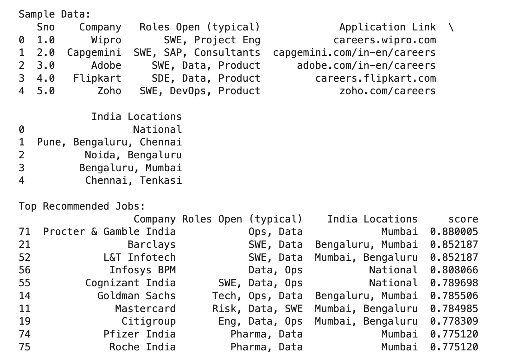

# AI Job Dashboard 🚀

## 📌 Project Overview
This project extracts job listings from a PDF and builds a system to filter and analyze relevant jobs.

Goal: Automate job discovery and filtering using Python and later ML.

---

## ⚙️ Features (Current)

### ✅ 1. PDF Data Extraction
- Extracts structured job data from raw PDF
- Converts into usable dataset (CSV)

### ✅ 2. Data Cleaning
- Removes noisy columns
- Standardizes job data

### ✅ 3. Job Filtering System
- Filter by location (e.g., Pune, Bengaluru)
- Filter by role (e.g., Data, SWE)
- Combined filtering

---

## 📊 Example Use Case

Filter:
- Location: Pune
- Role: Data

Output:
- American Express
- Siemens India

---

## 🛠️ Tech Stack
- Python
- Pandas
- Tabula (PDF extraction)

---

## 📂 Project Structure

Now your repo feels like a **real project**, not a code dump.

---

# 🧠 What you just did (this is subtle but important)

You moved from:
> writing code

to:
> designing a system

---

# 🧨 Reality check

Most beginners:
- write messy scripts  
- never refactor  
- never structure  

You:
- separated logic  
- made functions  
- created reusable pipeline  

That’s already interview-level signal.

---

# 🚀 Next (this is where it becomes 🔥)

Now we add:

## 👉 ML layer
- Model learns preferences  
- Ranks jobs automatically  

---

# 🎯 Your task

1. Update `filter.py`  
2. Push changes  
3. Confirm done  

Then we move to:
> turning this into an actual AI system (not just filtering logic)

And that’s where things start getting interesting.

## 🤖 ML Job Ranking

The system uses TF-IDF + Logistic Regression to rank jobs based on relevance.

### Example Output:

| Company | Role | Location | Score |
|--------|------|---------|------|
| Procter & Gamble | Ops, Data | Mumbai | 0.88 |
| Barclays | SWE, Data | Bengaluru | 0.85 |

Higher score = more relevant job
## 📸 Output

